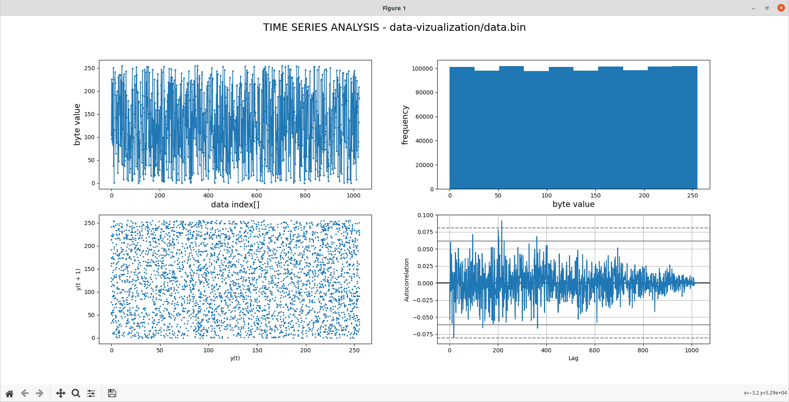
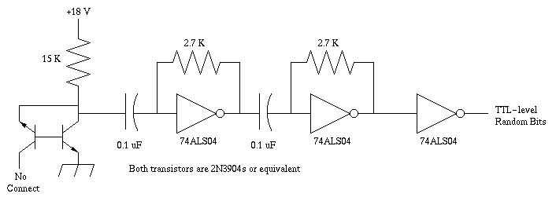

# Avalanche noise random number generator
Machines are predictable. In reality, most random numbers are actually pseudo-random, which means they are generated in a predictable way using mathematical formulas. 

John von Neumann once said that anybody who contemplates arithmetic methods for the generation ofrandom numbers is in a state of sin. Therefore, if you try to generate random numbers using only software, the results will necessarily depend on the state of your machine at the outset of the process, and are therefore (at least in principle) insecure. That is, somebody could conceivably reconstruct your allegedly random bitstream. 

This is an attempt at generating truly random numbers by taking advantage of the avalanche noise generated by NPN transistors.




This circuit uses avalanche noise in a reverse-biased PN junction, the emitter-base junction of the first transistor. The second transistor amplifies it. The first two ALS04 inverters are biased into a linear region where they act like op amps, and they amplify itfurther. The third inverter amplifies it some more, and clips it to TTL levels.

Nice TODO
-----
@data-vizualization
  * threads for faster processing
  * migrate to gpu?
@avr
  * use volatile keyword in variables

Usage
-----

```
 # For data-vizualization:
 pip3 install numpy matplotlib pandas
```

Implementation
-----
Avalanche noise is the noise produced when a junction diode is operated at the onset of avalanche breakdown. It occurs when carriersacquire enough kinetic energy under the influence of the strong electric field to create additional electron-hole pairs by collidingwith the atoms in the crystal lattice. If this process happens to spill over into an avalanche effect, random noise spikes may be observed.

To create such noise one can use the base-emitter juction of a small signal npn transistor, because this junction has a relatively low breakdown voltage for many common devices.

Check for more information:
  * http://holdenc.altervista.org/avalanche/
  * https://web.jfet.org/hw-rng.html
